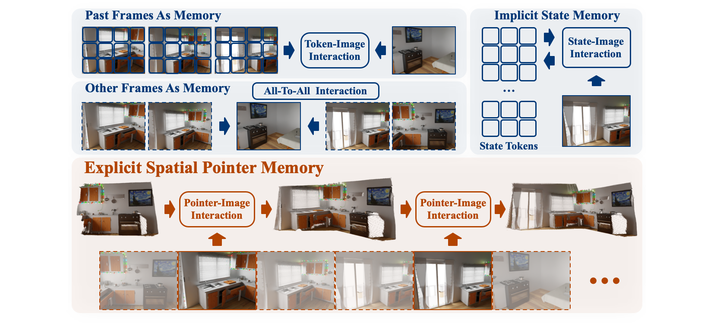
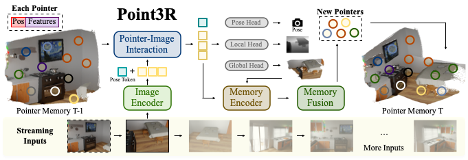

# Point3R: Streaming 3D Reconstruction with Explicit Spatial Pointer Memory
### [Paper]()  | [Project Page]() 

> Point3R: Streaming 3D Reconstruction with Explicit Spatial Pointer Memory

> Yuqi Wu<sup>\*</sup>, [Wenzhao Zheng](https://wzzheng.net/)<sup>*</sup>$\dagger$, [Jie Zhou](https://scholar.google.com/citations?user=6a79aPwAAAAJ&hl=en&authuser=1), [Jiwen Lu](http://ivg.au.tsinghua.edu.cn/Jiwen_Lu/)

<sup>*</sup> Equal contribution. $\dagger$ Project leader.

We propose Point3R, an online framework targeting **dense streaming 3D reconstruction**.

## Overview



We propose Point3R, an online framework targeting **dense streaming 3D reconstruction**.
Given streaming image inputs, our method maintains **an explicit spatial pointer memory** in which each pointer is assigned a 3D position and points to a changing spatial feature. We conduct a pointer-image interaction to integrate new observations into the global coordinate system and update our spatial pointer memory accordingly. Our method achieves competitive or state-of-the-art performance across various tasks: dense 3D reconstruction, monocular and video depth estimation, and camera pose estimation.



## Getting Started

### Installation
Follow instructions [HERE](docs/installation.md) to prepare the environment.

### Data Preparation
Please follow [CUT3R](https://github.com/CUT3R/CUT3R/blob/main/docs/preprocess.md) to prepare the training datasets. The official links of all used datasets are listed below.

  - [ARKitScenes](https://github.com/apple/ARKitScenes) 
  - [BlendedMVS](https://github.com/YoYo000/BlendedMVS)
  - [CO3Dv2](https://github.com/facebookresearch/co3d)
  - [Hypersim](https://github.com/apple/ml-hypersim)
  - [MegaDepth](https://www.cs.cornell.edu/projects/megadepth/)
  - [MVS-Synth](https://phuang17.github.io/DeepMVS/mvs-synth.html)
  - [OmniObject3D](https://omniobject3d.github.io/)
  - [PointOdyssey](https://pointodyssey.com/)
  - [ScanNet++](https://kaldir.vc.in.tum.de/scannetpp/) 
  - [ScanNet](http://www.scan-net.org/ScanNet/)
  - [Spring](https://spring-benchmark.org/)
  - [Virtual KITTI 2](https://europe.naverlabs.com/research/computer-vision/proxy-virtual-worlds-vkitti-2/)
  - [WayMo Open dataset](https://github.com/waymo-research/waymo-open-dataset)
  - [WildRGB-D](https://github.com/wildrgbd/wildrgbd/)

## Training
Please follow [train.md](docs/train.md).

## Evaluation

Please follow [eval.md](docs/eval.md).

## Checkpoints and Inference

Coming soon.

## Acknowledgements
Our code is based on the following awesome repositories:

- [DUSt3R](https://github.com/naver/dust3r)
- [MonST3R](https://github.com/Junyi42/monst3r.git)
- [Spann3R](https://github.com/HengyiWang/spann3r.git)
- [CUT3R](https://github.com/CUT3R/CUT3R)

Very thanks to these authors!

## Citation

If you find this project helpful, please consider citing the following paper:
```

```

